# Week 2 Assignment

This assignment focuses on the genome of *Enterococcus faecium*. 

## Data
The genome sequence and associated annotation files were obtained from [here](https://www.ncbi.nlm.nih.gov/datasets/genome/GCF_009734005.1/). 
Orifinal files can be accessed from NCBI:
- `genome.fna.gz`: https://ftp.ncbi.nlm.nih.gov/genomes/all/GCF/009/734/005/GCF_009734005.1_ASM973400v2/GCF_009734005.1_ASM973400v2_genomic.fna.gz
- `genome.gff.gz`: https://ftp.ncbi.nlm.nih.gov/genomes/all/GCF/009/734/005/GCF_009734005.1_ASM973400v2/GCF_009734005.1_ASM973400v2_genomic.gff.gz


## week02 Structure 
The `week02` directory contains the files and directories used for this genome visualization project. The directory is organized as follows:
```text
week02/
├── fasta/
│   └── Efaecium.fna
│   └── Efaecium.fna.fai
│   └── Efaecium.fna.gz
├── gff/
│   └── Efaecium.gff
│   └── Efaecium.gff.gz
├── Makefile
└── README.md
```
The original NCBI filenames contain accession numbers taht can be difficult to interpret, so to make the files easier to identify, the files are renamed using the common abbreviation: `Efaecium`. 


## Makefile
The Makefile creates the appropriate directories and downloads the files into their corresponding directories.

### Generating the Makefile
I generated the Makefile using the following prompt:

> I am doing bioinformatics at the command line. I need a Makefile that downloads the FASTA file from: https://ftp.ncbi.nlm.nih.gov/genomes/all/GCF/009/734/005/GCF_009734005.1_ASM973400v2/GCF_009734005.1_ASM973400v2_genomic.fna.gz and the gff file from: https://ftp.ncbi.nlm.nih.gov/genomes/all/GCF/009/734/005/GCF_009734005.1_ASM973400v2/GCF_009734005.1_ASM973400v2_genomic.gff.gz. Put files based on their type in a directory named after the data type: fasta files in a fasta directory, gff files in a gff directory, etc. The accession number is hard to read. I want to have a genome name, then after downloading the data, rename the file to match the genome name. The current genome name should be Efaecium. After downloading the FASTA file, decompress it so that the uncompressed FASTA file is available as fasta/Efaecium.fna. Keep the original compressed file fasta/Efaecium.fna.gz as well. Create a FASTA index for the uncompressed FASTA file using samtools faidx, so that fasta/Efaecium.fna.fai is also generated. The GFF file should also be decompressed so that gff/Efaecium.gff is available, while keeping the original gff/Efaecium.gff.gz file. Make sure the Makefile correctly handles dependencies, so that the FASTA index is created only after the FASTA file has been downloaded and decompressed. Also include a clean target that removes generated files without removing the original Makefile.

The resulting Makefile was saved in the `week02` directory and is used to automate the download and organization of the genome data.

### Running the Makefile
To run the Makefile, navigate to the `week02` direcotry and run:
```
make
```


## Questions
### Obtain Genomic Data
#### How large is the genome? How many chromosomes does it have?
First, navigate to the `fasta` directory:
```
cd fasta
```
To inspect the FASTA file, I checked the first 10 lines using:
```
gzip -cd Efaecium.fna.gz | head
```
output:
```
>NZ_CP038996.1 Enterococcus faecium strain SRR24 chromosome, complete genome
ATGGTATCCCTCGATGCTTTATGGAATGAATTAAAAGCAACATACCAAAAGGATTTATCGCCTGCTAGCTATAATACATG
GATCGAAACAGCGAACCCTCGAACCCTTGATCAAAACCAGCTCGTTGTTGAGGTTCCTAGCAAGATTCATAAAGAATATT
GGGAAAAAAACCTGGCGACAAAAATCGTTGAAGTCGGTTATATGTTATCAGGAAATGAGATTATCCCTCGCTTTATTACT
GGCGAAGAAGCAGAGCAAGAAGAAGTTATAGAAGAAAAAAATCCAAAAGTTGTGGCACCTAGTCCGCTAAAAAAAGCCAT
GCTGAACCCTAAATATACCTTTGATACGTTTGTCATTGGTAAAGGAAACCAGATGGCTCATGCAGCAGCGCTCGTTGTAG
CAGAAGATCCAGGTTCTATTTATAACCCGCTCTTCTTTTATGGAGGCGTGGGACTTGGTAAGACTCACTTGATGCATGCA
ATTGGTCATCAAATGCTGCAAAGTCAGCCTAATGCCAAAGTAAAATATGTAAGCAGTGAAACTTTTGCTAATGATTTCAT
CAATTCGATCCAAAACAAAACAGCAGAAGAGTTCCGTCAAGAATATCGAAATGTTGATTTACTGCTAGTGGATGACATTC
AATTTTTTGCAGAAAAAGAAGCTACGCAAGAAGAGTTTTTCCATACTTTCAATGCCTTGTACAATGAAGGGAAACAAATC

```
Here, we can identify the accession number for the genome sequence as **NZ_CP038996.1**. The sequence is from *E. faecium* **strain SRR24**, and the record describes it as a **complete genome**.

To check how large the genome is, I used seqkit:
```
seqkit stats Efaecium.fna.gz
```
output:
```
file             format  type  num_seqs    sum_len  min_len    avg_len    max_len
Efaecium.fna.gz  FASTA   DNA          2  2,919,198  123,020  1,459,599  2,796,178
```
Here, we can see that the genome contains 2,919,198 bases, or approximately 2.92 Mb. 

To identify the genomic sequences included in the FASTA file, I extracted the FASTA header lines using:
```
gzip -cd Efaecium.fna.gz | grep "^>"
```
output:
```
>NZ_CP038996.1 Enterococcus faecium strain SRR24 chromosome, complete genome
>NZ_CP038997.1 Enterococcus faecium strain SRR24 plasmid pSRR24
```
The output shows that this contains two sequence records: **NZ_CP038996.1**, which is the complete chromosome of *E. faecium* strain SRR24 and **NZ_CP038997.1**, which is the plasmid pSRR24. Thus, the FASTA file contains **one chromosome and one plasmid**.

To determine the length of each sequence, I used:
```
seqkit fx2tab -n -l Efaecium.fna.gz
```
output:
```
NZ_CP038996.1 Enterococcus faecium strain SRR24 chromosome, complete genome	2796178
NZ_CP038997.1 Enterococcus faecium strain SRR24 plasmid pSRR24	123020
```


#### How many annotations are in the annotation file?
First, navigate to the `gff` directory:
```
cd ../gff
```
To determine the total number of annoations in the GFF file, I used:
```
gzip -cd Efaecium.gff.gz | grep -v "^#" | wc -l
```
output:
```
5934
```
This means there are 5,934 annotations in this GFF file, exluding metadata and comment lines beginning with `#`.

I also examined the types of annotated features using:
```
gzip -cd Efaecium.gff.gz | grep -v "^#" | awk '{print $3}' | sort | uniq -c
```
output:
```
  20 CDS
2798 Homology
   1 RNase_P_RNA
   1 SRP_RNA
  12 binding_site
  92 exon
2814 gene
   1 ncRNA
  88 pseudogene
  18 rRNA
   2 region
  12 riboswitch
   4 sequence_feature
  70 tRNA
   1 tmRNA
```


#### How complete is this genomic build in your opinion?
In my opinion, this assembly is highly complete because it contains one complete chromosome and one plasmid named pSRR24. The chromosome is represented by a single sequence, not multiple unplaced contigs. 


### Visualize a Genome using 
After loading the genome data into IGV, I selected *E. faecium* from the genome dropdown menu. The genome contains one chromosome and one plasmid. For the genome browser analysis, I selected the chromosome `NZ_CP038996.1` from the chromosome/sequence dropdown. It should be looking like this:
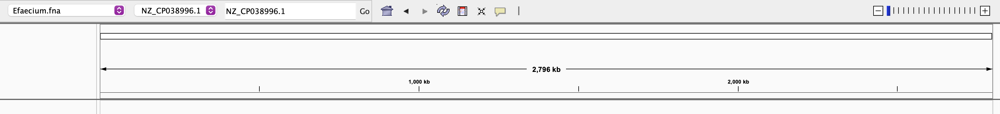

#### How tightly packed are the genes in this genome? Estimate the gene-to-gene distance via the browser.
To estimate how tightly packed the genes are in the chromosome, I first looked at several regions of the chromosoms using IGV. 

1. `NZ_CP038996.1:100000-110000`
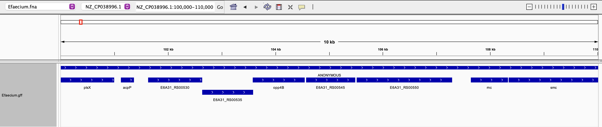
2. `NZ_CP038996.1:540000-550000`
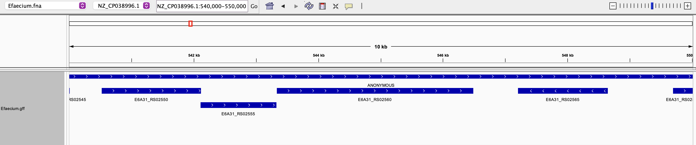
3. `NZ_CP038996.1:1070000-1080000`
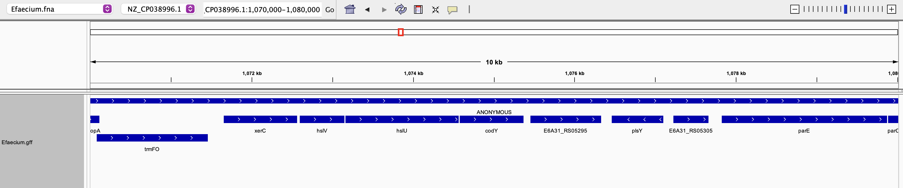
4. `NZ_CP038996.1:1730000-1740000`
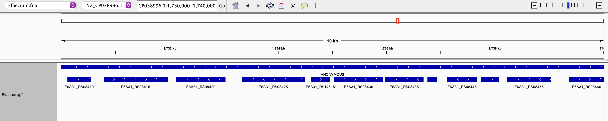
5. `NZ_CP038996.1:2210000-2220000`
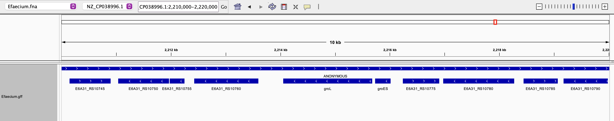

Then, I examined the genomic coordinates of consecutive genes in the region 3 (`NZ_CP038996.1:1070000-1080000`) and calculated the distance between the end of one gene and the beginning of the next gene:
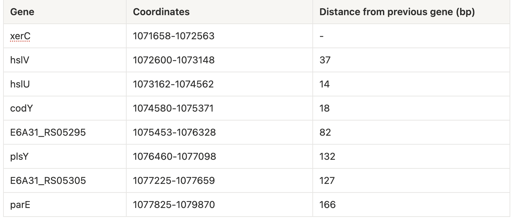

We can see that the genes appear to be tightly packed. The distances between neighboring genes ranged from approximately 14 to 166 bp, **with an average distance of about 82 bp**.


#### Pick a coordinate on the chromosome and visually inspect the sequence regions around it. Describe all six reading frames (codons) that the coordinate could be part of. Identify the type of feature displayed as a data track. 
To investigate the sequence surrounding a specific genomic coordinate, I selected the `codY` gene and chose a coordinate near the middle of the gene, **1,074,960**.

Forward Strands:
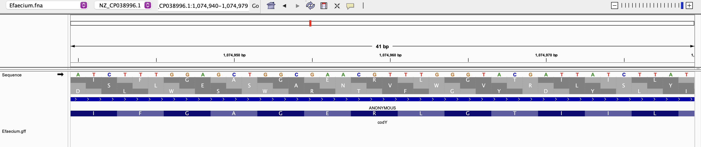

Reverse Strands:
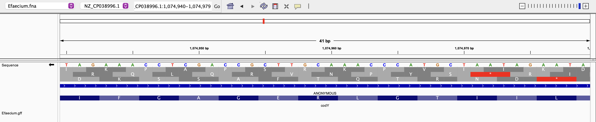

The six possible reading frames at the selected coordinate are:
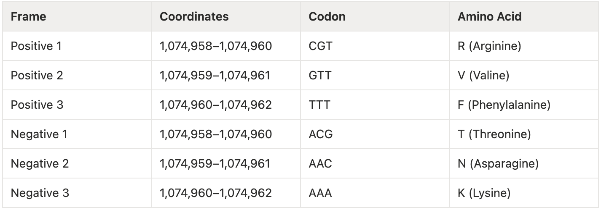

The annotated information for the selected `codY` region was obtained from IGV and is shown below:
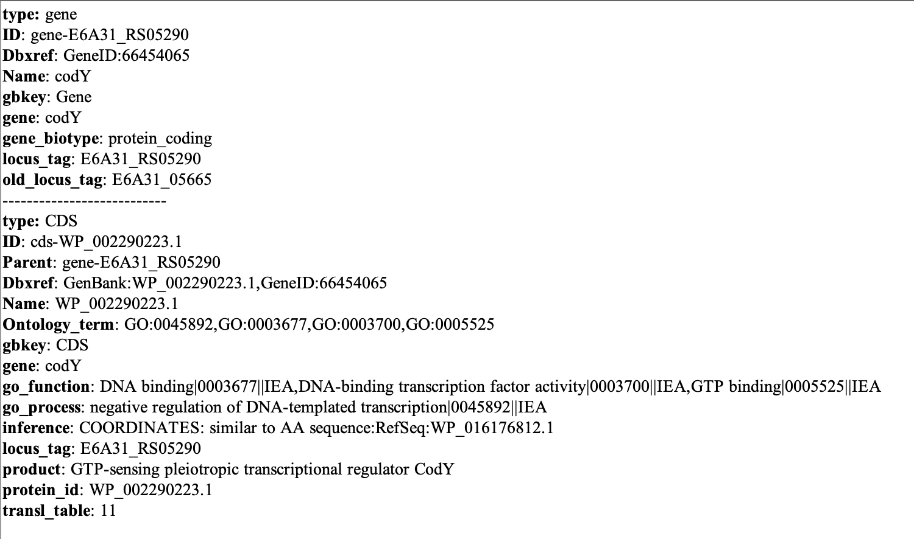

The data track displayed in IGV contains annotated gene and CDS features. At the selected region, the `codY` gene is annotated as a protein-coding gene with the locus tag `E6A31_RS05290`.

The corresponding CDS is annotated with the protein ID `WP_002290223.1` and is predicted to encode a `GTP-sensing pleiotropic transcriptional regulator CodY`. 


#### Color features by their strand orientation.
To distinguish the strand orientation of the annotated features, I used different colors in IGV. Features on the positive strands were colored **red**, while features on the negative strands were colored **blue**.

The resulting visualization is shown below:
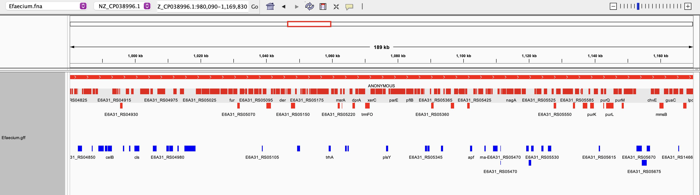