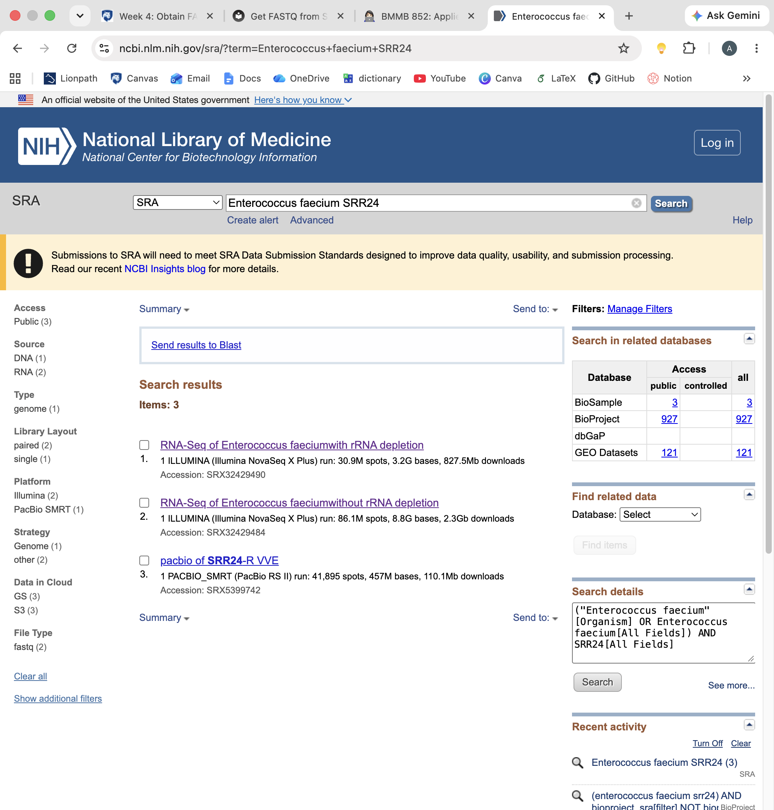
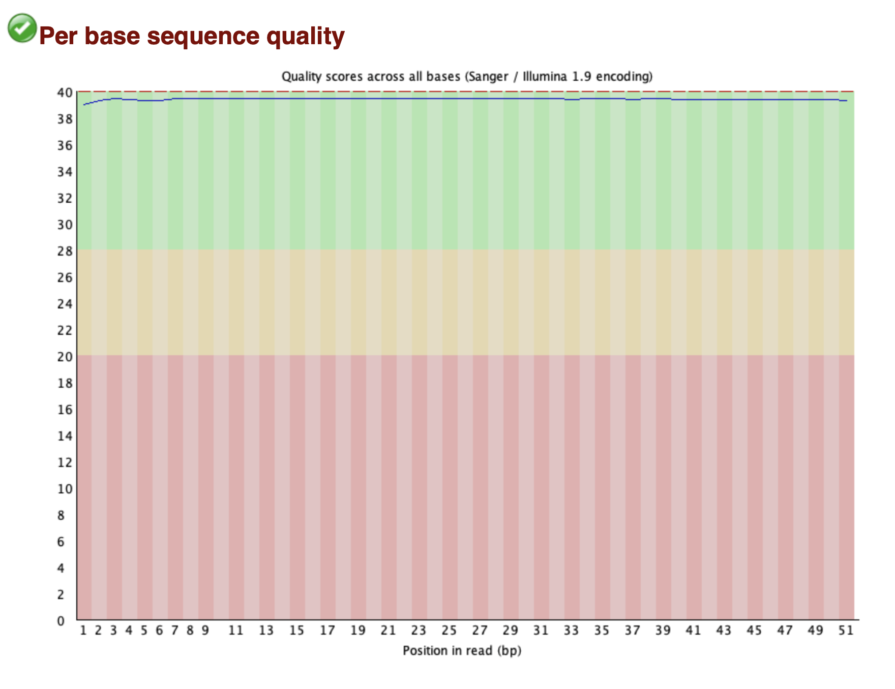
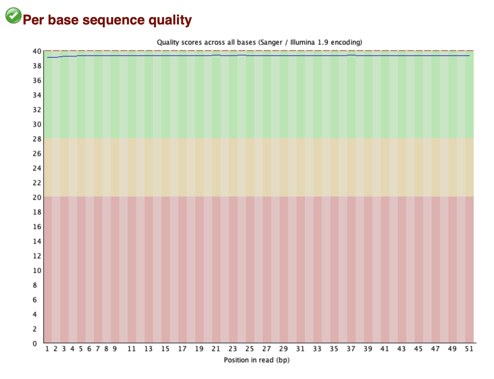
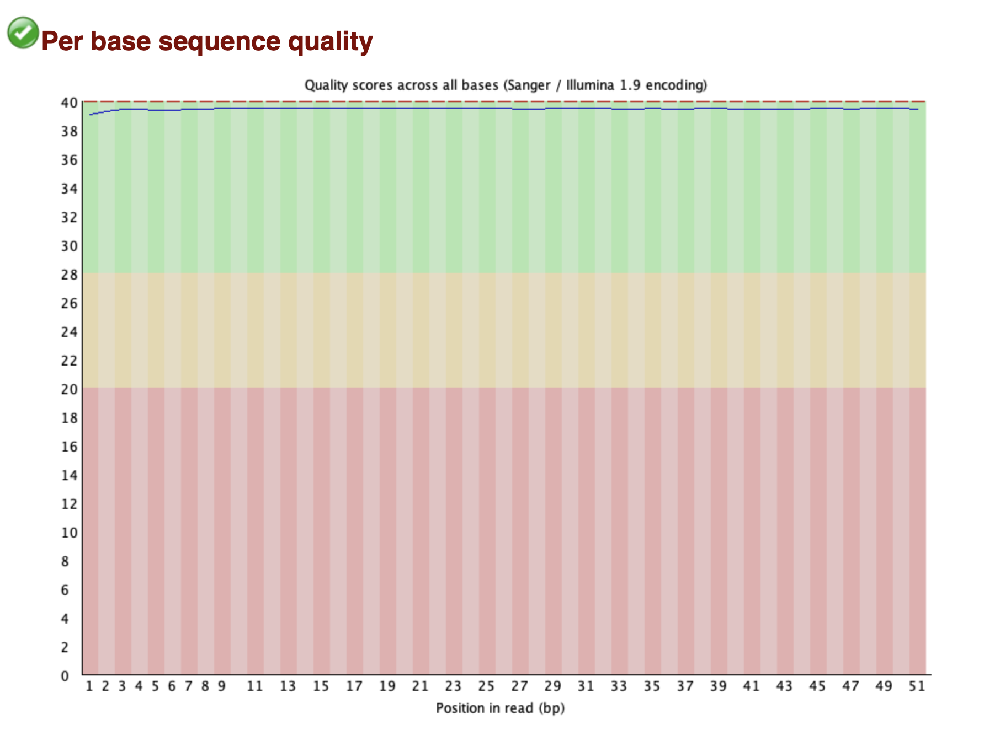
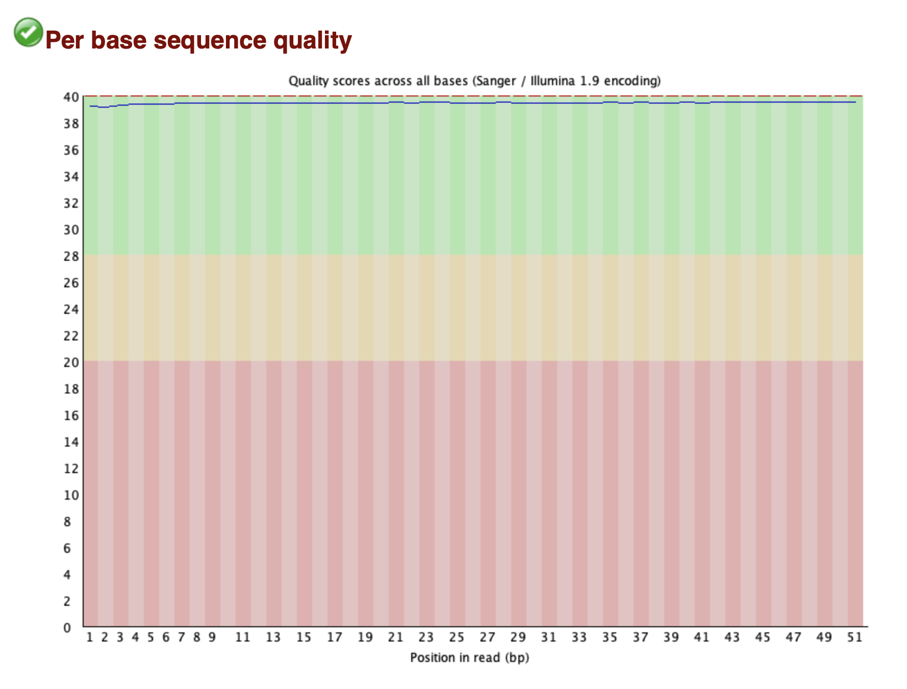
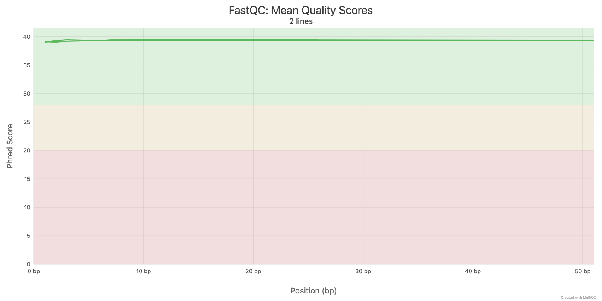

# Week 4 Assignment 

This assignment investigates the availability and characteristics of publicly available sequencing data for [***Enterococcus faecium*** strain SRR24](https://www.ncbi.nlm.nih.gov/sra/?term=Enterococcus+faecium+SRR24).

The NCBI Sequence Read Archive (SRA) was searched using the query:
`Enterococcus faecium SRR24`. The search was performed on September 20, 2026. It returned three SRA experiment records.



## Available Sequencing Data
The search returned three experiments representing both transcriptomic and genomic sequencing data:

| Experiment | Description | Source | Platform | Layout | Runs |
| -------- | -------- | -------- | -------- | -------- | -------- |
| [SRX32429490](https://www.ncbi.nlm.nih.gov/sra/SRX32429490[accn]) | RNA-seq with rRNA depletion | METATRANSCRIPTOMIC | Illumina NovaSeq X Plus | Paired | 1 |
| [SRX32429484](https://www.ncbi.nlm.nih.gov/sra/SRX32429484[accn]) | RNA-seq without rRNA depletion | METATRANSCRIPTOMIC | Illumina NovaSeq X Plus | Paired | 1 |
| [SRX5399742](https://www.ncbi.nlm.nih.gov/sra/SRX5399742[accn]) | Genome sequencing | GENOMIC | PacBio RS II | Single | 1 |

The exact SRR24 strain has a relatively small number of publicly available experiments, suggesting that it is not as extensively studied as more common reference strains. 

## QC for [SRX32429490](https://www.ncbi.nlm.nih.gov/sra/SRX32429490[accn])
The quality score for Read 1 before trimming:

The quality score for Read 2 before trimming:


The quality score for Read 1 after trimming:

The quality score for Read 2 after trimming:


Both Read 1 and Read 2 showed consistently high per-base sequence quality, with quality scores remaining around 39 across the entire 51bp read. There was no substantial decline in quality toward the ends of the reads. After trimming with `fastp`, the FastQC plots remained almost identical to the original plots. Therefore, trimming made little visual difference because the raw sequencing reads were already of very high quality.

MultiQC report for both reads (raw files):



## How to use Makefile

The prompt I used to generate Makefile with GPT-5.6 Luna can be found [here](https://gist.github.com/amygchoi/9257a9a7f32c254adc40c490b3a86e40).


The Makefile automates FASTQ downloading, quality assessment, trimming, and post-trimming quality assessment. By default, it processes `100,000` spots from `SRR37540651`.

To run the complete workflow:
```
make
```

Individual steps can also be run separately:
```
make download
make stats
make qc-raw
make trim
make qc-trimmed
make multiqc
```

| Target | Function |
| -------- | -------- |
| `make download` | Downloads the first `N` spots from the specified SRA run and separates paired-end reads into R1 and R2 FASTQ files |
| `make stats` | Uses `seqkit` to report the number, total length, and length distribution of the downloaded reads |
| `make qc-raw` | Runs FastQC on the original FASTQ files to assess their quality before trimming |
| `make trim` | Uses `fastp` to detect and remove adapter sequences and trim low-quality bases; Paired-end reads are processed together to preserve their pairing |
| `make qc-trimmed` | Runs FastQC on the trimmed FASTQ files to evaluate whether trimming changed the read quality |
| `make multiqc` | Combines the FastQC and `fastp` reports into a single MultiQC report |
| `make clean` | Deletes the results directory for the selected accession and subset size |
&nbsp;

A different SRA run or subset size can be specified using the `ACC` and `N` variables:
```
make ACC=PRJNA1439525 N=10000
```

The resulting files are stored in `results/<accession>_<N>/`. To delete the results for the selected accession and subset size:
```
make clean ACC=PRJNA1439525 N=10000
```