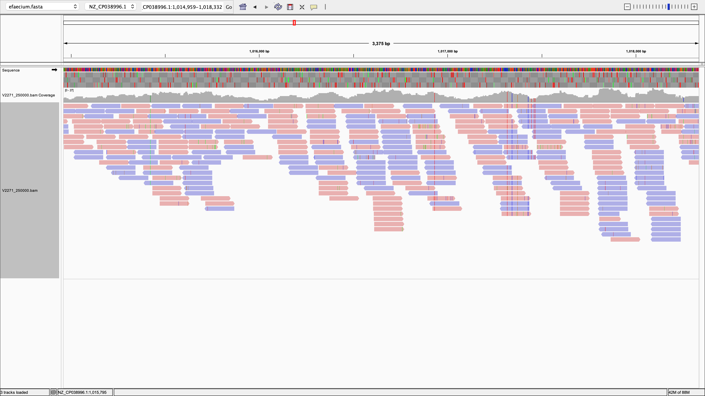
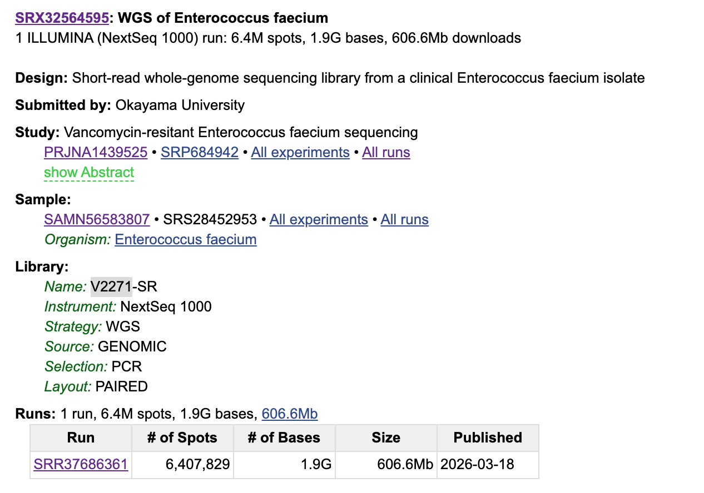

# Week 5 Assignment

## Sequencing Data and Reference Genome
For this assignment, I aligned paired-end reads from experiment [SRX32564595](https://www.ncbi.nlm.nih.gov/sra/SRX32564595[accn]) (run [ `SRR37686361`](https://trace.ncbi.nlm.nih.gov/Traces/?view=run_browser&acc=SRR37686361&display=metadata)) in the [Vancomycin-resistant *Enterococcus faecium* sequencing BioProject (PRJNA1439525)](https://www.ncbi.nlm.nih.gov/bioproject/PRJNA1439525). I aligned them to *E. faecium* SSR24 reference genome [GCF_009734005.1](https://www.ncbi.nlm.nih.gov/datasets/genome/GCF_009734005.1/).

## Results

### N

From the previous assignment (week2), I know that the reference consists of a 2,796,178 bp chromosome and a 123,020 bp plasmid. I first aligned 150,000 paired-end read pairs and ran `samtools coverage results/V2271_150000.bam` and got 7.56x for meandepth. Assuming depth increases approximately in proportion to the number of read pairs, 150,000 (10 / 7.56) ≈ 198,000 pairs. So, I chose `N = 250000` to provide a margin above this estimate. To check the final chromosome mean depth, I ran: 
```
samtools coverage results/V2271_250000.bam
```
The output was:
```
#rname	startpos	endpos	numreads	covbases	coverage	meandepth	meanbaseq	meanmapq
NZ_CP038996.1	1	2796178	240994	2590270	92.6361	12.5801	38.3	53.6
NZ_CP038997.1	1	123020	67980	95659	77.7589	79.7978	38.4	55.5
```
Here, you can see that the meandepth is **12.58x**, which exceeds the 10x target. 


### Percent of the reads aligned

I used `samtools flagstat` to summarize the final BAM file:

```
samtools flagstat results/V2271_250000.bam
```
The output was:
```
502902 + 0 in total (QC-passed reads + QC-failed reads)
500000 + 0 primary
0 + 0 secondary
2902 + 0 supplementary
0 + 0 duplicates
0 + 0 primary duplicates
308974 + 0 mapped (61.44% : N/A)
306072 + 0 primary mapped (61.21% : N/A)
500000 + 0 paired in sequencing
250000 + 0 read1
250000 + 0 read2
294566 + 0 properly paired (58.91% : N/A)
301600 + 0 with itself and mate mapped
4472 + 0 singletons (0.89% : N/A)
954 + 0 with mate mapped to a different chr
280 + 0 with mate mapped to a different chr (mapQ>=5)
```
The report showed that 306,072 of 500,000 primary reads mapped to the reference genome. Therefore, the primary read alignment rate was **61.21%**.


### IGV


I visualized `V2271_250000.bam` against the SRR24 reference genome in IGV. Reads align in both directions, and most bases in the displayed chromosome region match the reference. Some colored bases indicate mismatches. A mismatch in a single read could be a sequencing error, while the same mismatch in multiple reads could reflect a difference between the V2271 sample and the SRR24 reference.

Coverage is not completely uniform. In the IGV view, the height of the coverage track changes across the chromosome region. `samtools coverage` reported a mean depth of 12.58× for the chromosome, but 92.64% of its bases were covered by at least one read, so some positions were uncovered. 


## Makefile and usage
The Makefile downloads the *E. faecium* SRR24 reference genome and a subset of paired-end reads from SRA run `SRR37686361`. It indexes the reference with BWA, aligns the reads, sorts and indexes the BAM file, and generates a `samtools flagstat` report. I used `V2271` as the sample name because it appears in the *Name* field of the SRA experiment record.


By default, the Makefile processes the first 250,000 spots. To run the complete workflow, run:
```
make
```

A different subset size can be specified with N. For example:
```
make N=100000
```

Individual targets can also be run separately:

| Target        | Function                                                                                                  |
| ------------- | --------------------------------------------------------------------------------------------------------- |
| `make genome` | Downloads and decompresses the reference genome FASTA file.                                               |
| `make fastq`  | Downloads the first `N` spots from `SRR37686361` and separates the paired-end reads into two FASTQ files. |
| `make index`  | Builds the BWA index for the reference genome.                                                            |
| `make align`  | Aligns the paired-end reads with `bwa mem`, then sorts and indexes the BAM file.                          |
| `make stats`  | Generates a `samtools flagstat` report for the BAM file.                                                  |
| `make clean`  | Removes the downloaded reference and reads, along with the generated alignment files.                     |

With the default N, the final BAM file is `results/V2271_250000.bam`, and the alignment report is `results/V2271_250000.bam.flagstat`. Coverage statistics can be viewed with:
```
samtools coverage results/V2271_250000.bam
```
