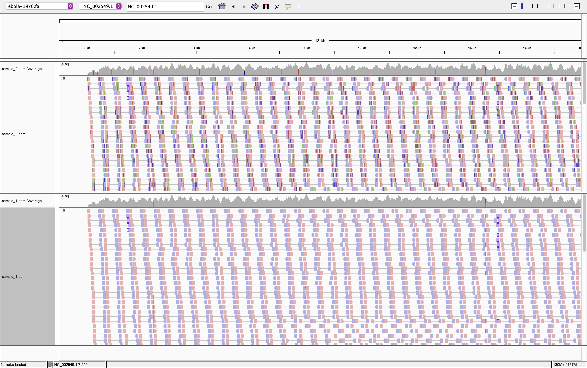
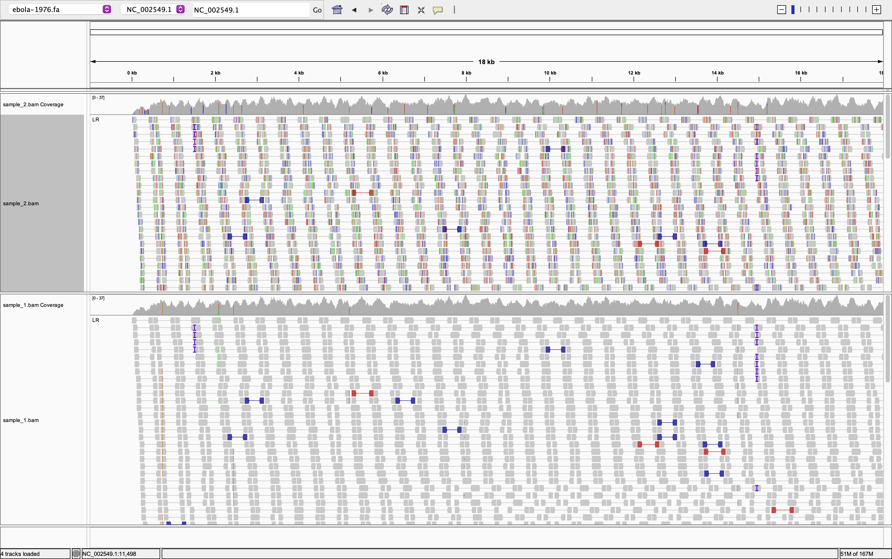
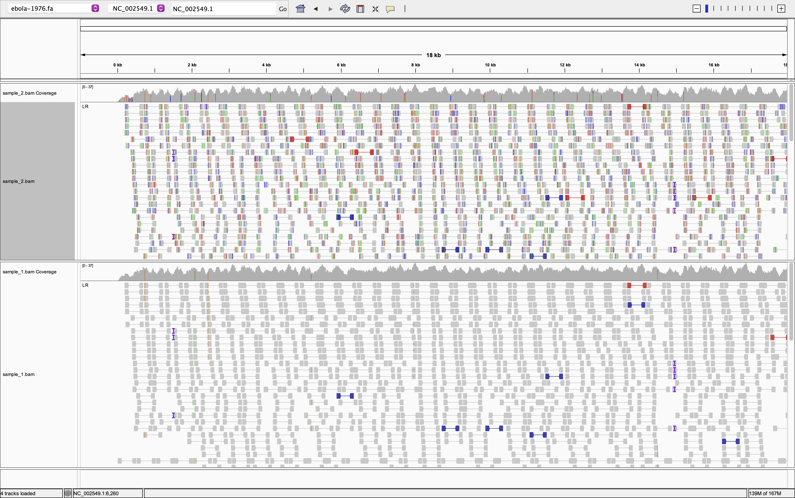
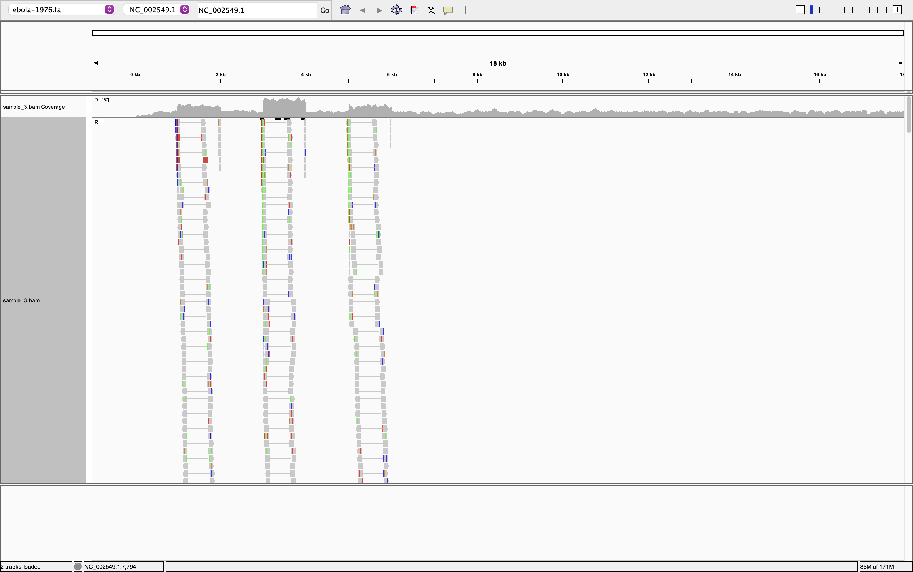
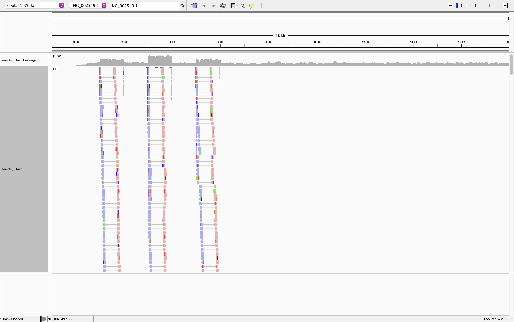
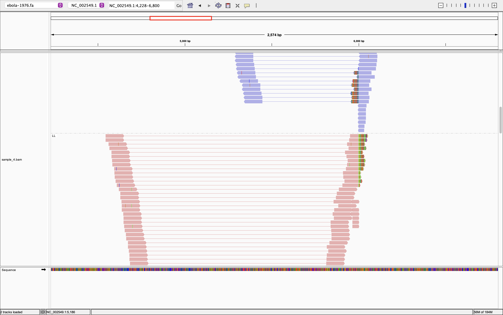
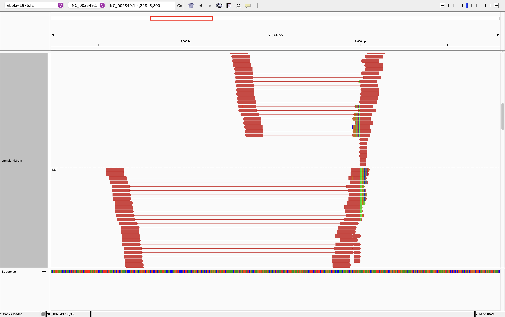
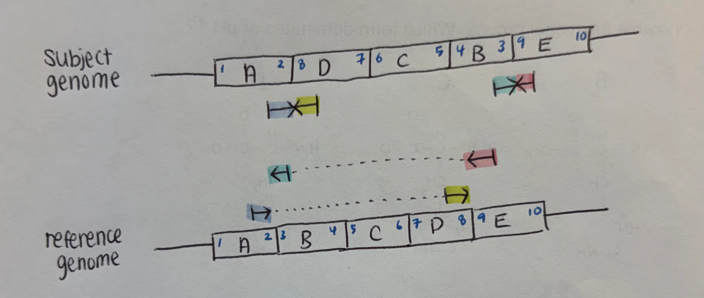
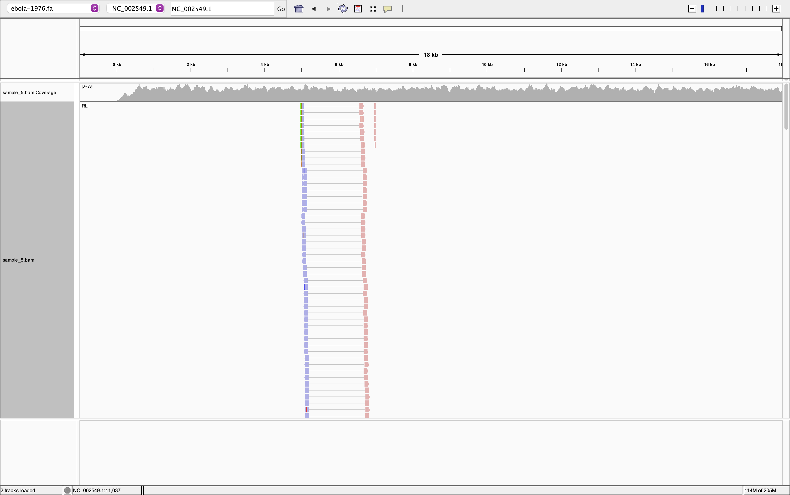
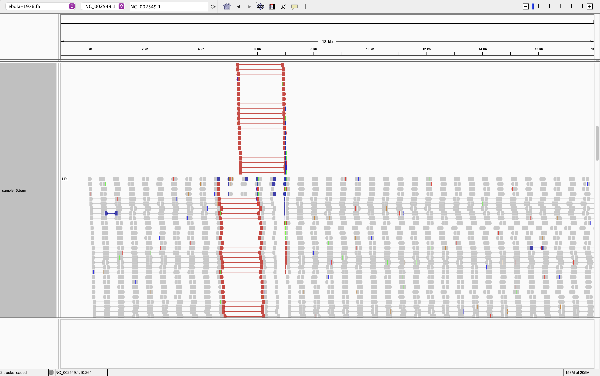

# Week 6 Assignment

## Sample 1 and Sample 2

View as pairs, grouped by pair orientation, and colored by read strand

Colored by insert size

Sorted by start location 

I did not observe a clear difference between Sample 1 and Sample 2 after comparing them using color by read strand, color by insert size, group by pair orientation, and sort by start location. Sample 1 showed fewer soft-clipped bases, which may reflect trimming before alignment. However, this cannot be confirmed from the IGV view alone, and I could not identify a distinct structural variation in Sample 1. Sample 2 appeared similar to Sample 1 across the visualization settings examined, but showed more soft-clipped bases. One possible explanation is that Sample 2 retained read-end sequences that were trimmed from Sample 1. Differences in alignment processing could also explain this observation though. I coudln't find any structural variance in Sample 2 either. 

## Sample 3

View as pairs, grouped by pair orientation, and colored by insert size

Colored by read strand

When viewing reads as pairs, grouping by pair orientation, and coloring by insert size, I observed a consistent cluster of outward facing RL pairs in three regions. Coverage was high in the same regions. These reads remained gray under insert-size coloring, indicating the inferred insert size is neither larger nor shorter the expected insert size. Together, the localized RL pattern and increased coverage are consistent with a possible tandem duplication relative to the reference genome. But I can't say this with confidence. 

## Sample 4

View as pairs, grouped by pair orientation, and colored by read strand

colred by insert size

I observed clusters of RR and LL pairs in a similar region, suggesting a possible inversion relative to the reference genome. When colored by insert size, these pairs appeared red, indicating that the inferred insert size is larger than the expected insert size. This pattern could arise from pairs spanning an inversion boundary, with one read inside the inverted segment and its mate outside, causing both orientation and apparent distance to change when aligned to the reference.

Possible explanation for the alignment pattern in Sample 4. In this drawing, the B–C–D segment is inverted relative to the reference genome. Read pairs spanning the inversion boundaries align in the same direction and farther apart on the reference, producing RR or LL orientations and larger inferred insert sizes. This illustrates how an inversion could explain the pattern observed in this sample.

## Sample 5

View as pairs, grouped by pair orientation, and colored by read strand

Colred by insert size

I observed a cluster of outward-facing RL pairs. All observed RL pairs, as well as nearby LR pairs, appeared red when colored by insert size, indicating the inferred insert size is larger than the expected insert size. The RL cluster suggests an altered genomic arrangement, while the large insert sizes of the LR pairs could be related to a deletion in the genome. However, a simple deletion would not explain the RL orientation, so the observations suggest a possible rearrangement whose type remains uncertain. It could be translocation. 